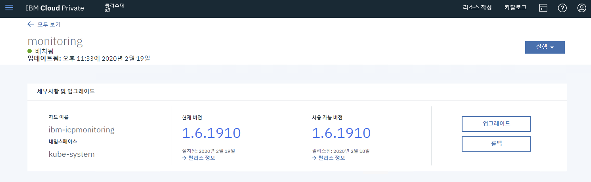
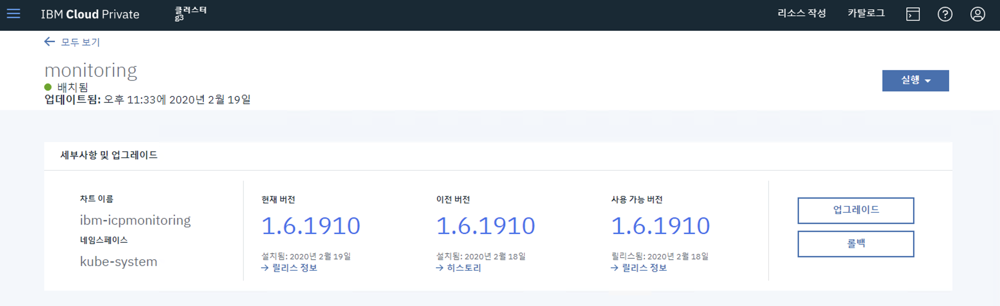
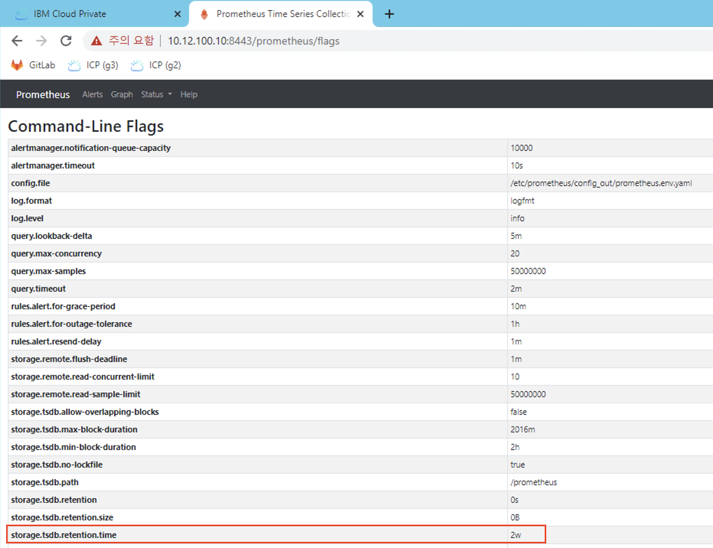
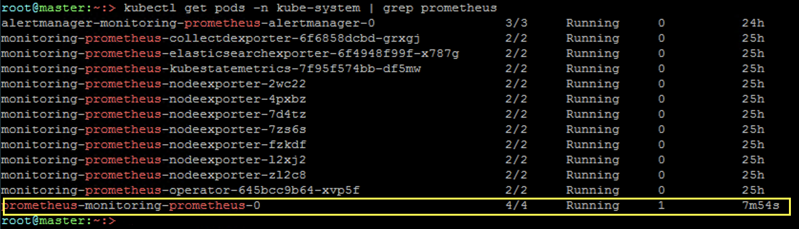
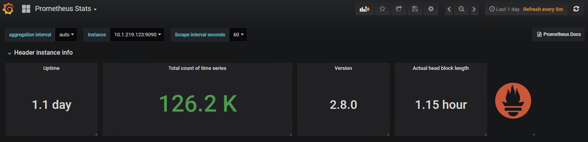

# ICP v3.2.1.2001 monitoring Helm Chart 수정 (Prometheus 보관 주기 변경 : 1일 -> 2주)

## g3 cluster helm update


```sh
#helm get values logging --tls > values-old.yaml
helm get values monitoring --tls > values-old.yaml
```

```console
root@master:~:> helm get values monitoring --tls > values-old.yaml
root@master:~:> ls -artl
-rw-r--r--   1 root root  1653  2월 19 23:17 values-old.yaml
```

```sh
#curl -k https://<master ip>:8443/mgmt-repo/requiredAssets/ibm-icplogging-x.y.z.tgz > ibm-icplogging-x.y.z.tgz
curl -k https://10.12.100.10:8443/mgmt-repo/requiredAssets/ibm-icpmonitoring-1.6.1910.tgz > ibm-icpmonitoring-1.6.1910.tgz
```

```console
root@master:~:> curl -k https://10.12.100.10:8443/mgmt-repo/requiredAssets/ibm-icpmonitoring-1.6.1910.tgz > ibm-icpmonitoring-1.6.1910.tgz
  % Total    % Received % Xferd  Average Speed   Time    Time     Time  Current
                                 Dload  Upload   Total   Spent    Left  Speed
100  123k  100  123k    0     0   777k      0 --:--:-- --:--:-- --:--:--  783k

root@master:~:> ls -artl
-rw-r--r--   1 root root   1653  2월 19 23:17 values-old.yaml
-rw-r--r--   1 root root 126021  2월 19 23:21 ibm-icpmonitoring-1.6.1910.tgz
```

```console

root@master:~:> mkdir -p helm-works
root@master:~:> mv ibm-icpmonitoring-1.6.1910.tgz ./helm-works
root@master:~:> cd helm-works/
root@master:~/helm-works:> gunzip *.tgz
root@master:~/helm-works:> tar xvf *.tar
ibm-icpmonitoring/Chart.yaml
ibm-icpmonitoring/values.yaml
ibm-icpmonitoring/templates/NOTES.txt
ibm-icpmonitoring/templates/_alertmanager.tpl
ibm-icpmonitoring/templates/_grafana.tpl
ibm-icpmonitoring/templates/_grafana_dashboards.tpl
ibm-icpmonitoring/templates/_grafana_datasource.tpl
ibm-icpmonitoring/templates/_helpers.tpl
ibm-icpmonitoring/templates/_prometheus_scrape_targets.tpl
ibm-icpmonitoring/templates/_version.tpl
ibm-icpmonitoring/templates/alert-rule-crd.yaml
ibm-icpmonitoring/templates/alert-rules/elasticsearch-cluster-health.yaml
ibm-icpmonitoring/templates/alert-rules/failed_jobs.yaml
ibm-icpmonitoring/templates/alert-rules/high-cpu-usage.yaml
ibm-icpmonitoring/templates/alert-rules/node-memory-usage.yaml
ibm-icpmonitoring/templates/alert-rules/pods-restarting.yaml
ibm-icpmonitoring/templates/alert-rules/pods-terminated.yaml
ibm-icpmonitoring/templates/alertmanager-config.yaml
ibm-icpmonitoring/templates/alertmanager-ingress.yaml
ibm-icpmonitoring/templates/alertmanager-resource.yaml
ibm-icpmonitoring/templates/alertmanager-router-config.yaml
ibm-icpmonitoring/templates/alertmanager-service.yaml
ibm-icpmonitoring/templates/cluster-role-binding.yaml
ibm-icpmonitoring/templates/cluster-role.yaml
ibm-icpmonitoring/templates/collectd-exporter-deployment.yaml
ibm-icpmonitoring/templates/collectd-exporter-metrics-service.yaml
ibm-icpmonitoring/templates/crd-cluster-roles.yaml
ibm-icpmonitoring/templates/dashboards/_helm-release-monitoring.tpl
ibm-icpmonitoring/templates/dashboards/_kubernetes-pod-overview.tpl
ibm-icpmonitoring/templates/dashboards/_mcm-clusters-monitoring.tpl
ibm-icpmonitoring/templates/dashboards/elasticsearch-monitoring.yaml
ibm-icpmonitoring/templates/dashboards/etcd-monitoring.yaml
ibm-icpmonitoring/templates/dashboards/helm-release-monitoring.yaml
ibm-icpmonitoring/templates/dashboards/icp-calico-monitoring.yaml
ibm-icpmonitoring/templates/dashboards/icp-glusterfs-monitoring.yaml
ibm-icpmonitoring/templates/dashboards/icp-minio-monitoring.yaml
ibm-icpmonitoring/templates/dashboards/icp-namespaces-performance.yaml
ibm-icpmonitoring/templates/dashboards/icp-performance.yaml
ibm-icpmonitoring/templates/dashboards/icp-rook-ceph-monitoring.yaml
ibm-icpmonitoring/templates/dashboards/kubernetes-monitoring.yaml
ibm-icpmonitoring/templates/dashboards/kubernetes-pod-overview.yaml
ibm-icpmonitoring/templates/dashboards/mcm-clusters-monitoring.yaml
ibm-icpmonitoring/templates/dashboards/nginx-ingress-controller.yaml
ibm-icpmonitoring/templates/dashboards/node-performance.yaml
ibm-icpmonitoring/templates/dashboards/prometheus-monitoring.yaml
ibm-icpmonitoring/templates/elasticsearch-exporter-client-cert.yaml
ibm-icpmonitoring/templates/elasticsearch-exporter-deployment.yaml
ibm-icpmonitoring/templates/elasticsearch-exporter-service.yaml
ibm-icpmonitoring/templates/exporter-router-config.yaml
ibm-icpmonitoring/templates/grafana-config.yaml
ibm-icpmonitoring/templates/grafana-dashboard-config.yaml
ibm-icpmonitoring/templates/grafana-dashboard-crd.yaml
ibm-icpmonitoring/templates/grafana-default-dashboards-config.yaml
ibm-icpmonitoring/templates/grafana-deployment-configmap.yaml
ibm-icpmonitoring/templates/grafana-deployment.yaml
ibm-icpmonitoring/templates/grafana-ingress.yaml
ibm-icpmonitoring/templates/grafana-lua-script-config.yaml
ibm-icpmonitoring/templates/grafana-pvc.yaml
ibm-icpmonitoring/templates/grafana-router-config.yaml
ibm-icpmonitoring/templates/grafana-service.yaml
ibm-icpmonitoring/templates/grafana-set-ds-config.yaml
ibm-icpmonitoring/templates/grafana-user-secret.yaml
ibm-icpmonitoring/templates/kube-state-metrics-deployment.yaml
ibm-icpmonitoring/templates/kube-state-metrics-service.yaml
ibm-icpmonitoring/templates/monitoring-certs.yaml
ibm-icpmonitoring/templates/monitoring-client-certs.yaml
ibm-icpmonitoring/templates/monitoring-delete-artifacts-job-configmap.yaml
ibm-icpmonitoring/templates/monitoring-delete-artifacts-job.yaml
ibm-icpmonitoring/templates/monitoring-exporter-certs.yaml
ibm-icpmonitoring/templates/monitoring-lua-script-config.yaml
ibm-icpmonitoring/templates/monitoring-prom-pv-upgrade-hook.yaml
ibm-icpmonitoring/templates/monitoring-upgrade-hook.yaml
ibm-icpmonitoring/templates/node-exporter-daemonset.yaml
ibm-icpmonitoring/templates/node-exporter-service.yaml
ibm-icpmonitoring/templates/prometheus-config.yaml
ibm-icpmonitoring/templates/prometheus-ingress.yaml
ibm-icpmonitoring/templates/prometheus-lua-script-config.yaml
ibm-icpmonitoring/templates/prometheus-operator-deployment.yaml
ibm-icpmonitoring/templates/prometheus-resource.yaml
ibm-icpmonitoring/templates/prometheus-router-config.yaml
ibm-icpmonitoring/templates/prometheus-service.yaml
ibm-icpmonitoring/templates/router-entry-config.yaml
ibm-icpmonitoring/templates/tests/alertmanager-test.yaml
ibm-icpmonitoring/templates/tests/grafana-test.yaml
ibm-icpmonitoring/templates/tests/prometheus-test.yaml
ibm-icpmonitoring/.helmignore
ibm-icpmonitoring/LICENSE
ibm-icpmonitoring/ORIGIN
ibm-icpmonitoring/README.md
ibm-icpmonitoring/RELEASENOTES.md
ibm-icpmonitoring/ibm_cloud_pak/manifest-amd64.yaml
ibm-icpmonitoring/ibm_cloud_pak/manifest-ppc64le.yaml
ibm-icpmonitoring/ibm_cloud_pak/manifest-s390x.yaml
ibm-icpmonitoring/ibm_cloud_pak/manifest.yaml
ibm-icpmonitoring/ibm_cloud_pak/qualification.yaml
ibm-icpmonitoring/values-metadata.yaml
root@master:~/helm-works:> ls -arlt
합계 1256
-rw-r--r--   1 root root 1281024  2월 19 23:21 ibm-icpmonitoring-1.6.1910.tar
dr-xr-x---. 13 root root    4096  2월 19 23:23 ..
drwxr-xr-x   3 root root      69  2월 19 23:23 .
drwxr-xr-x   4 root root     197  2월 19 23:23 ibm-icpmonitoring
root@master:~/helm-works:> cd ibm-icpmonitoring/
root@master:~/helm-works/ibm-icpmonitoring:> ls -artl
합계 112
-rwxr-xr-x 1 root root  5215  2월 18 22:58 values.yaml
-rwxr-xr-x 1 root root 45116  2월 18 22:58 values-metadata.yaml
-rwxr-xr-x 1 root root  1159  2월 18 22:58 RELEASENOTES.md
-rwxr-xr-x 1 root root 22240  2월 18 22:58 README.md
-rwxr-xr-x 1 root root   205  2월 18 22:58 ORIGIN
-rwxr-xr-x 1 root root 11357  2월 18 22:58 LICENSE
-rwxr-xr-x 1 root root   601  2월 18 22:58 Chart.yaml
-rwxr-xr-x 1 root root   365  2월 18 22:58 .helmignore
drwxr-xr-x 3 root root    69  2월 19 23:23 ..
drwxr-xr-x 5 root root  4096  2월 19 23:23 templates
drwxr-xr-x 2 root root   136  2월 19 23:23 ibm_cloud_pak
drwxr-xr-x 4 root root   197  2월 19 23:23 .
root@master:~/helm-works/ibm-icpmonitoring:>
```

```console
# 24m -> 14d

root@master:~/helm-works/ibm-icpmonitoring:> vi values.yaml
root@master:~/helm-works/ibm-icpmonitoring:> cat values.yaml

prometheus:
  enabled: true
  image:
    repository: g3.skb:8500/ibmcom/prometheus
    tag: v2.8.0-f1
  port: 9090
  scrapeInterval: 1m
  evaluationInterval: 1m
  retention: 14d

```

```console

root@master:~/helm-works/ibm-icpmonitoring:> cd ..
root@master:~/helm-works:> ls -arlt
-rw-r--r--   1 root root 1281024  2월 19 23:21 ibm-icpmonitoring-1.6.1910.tar
drwxr-xr-x   4 root root     197  2월 19 23:24 ibm-icpmonitoring

root@master:~/helm-works:> rm ibm-icpmonitoring-1.6.1910.tar
rm: remove 일반 파일 `ibm-icpmonitoring-1.6.1910.tar'? y

root@master:~/helm-works:> tar -cvzpf ibm-icpmonitoring-1.6.1910.tgz ibm-icpmonitoring
...

root@master:~/helm-works:> ls -arlt
drwxr-xr-x   4 root root    197  2월 19 23:24 ibm-icpmonitoring
-rw-r--r--   1 root root 102155  2월 19 23:28 ibm-icpmonitoring-1.6.1910.tgz
```

```console
root@master:~/helm-works:> rm -rf ibm-icpmonitoring
root@master:~/helm-works:> mv ibm-icpmonitoring-1.6.1910.tgz ../

root@master:~/helm-works:> ls -artl
dr-xr-x---. 13 root root 4096  2월 19 23:29 ..
drwxr-xr-x   2 root root    6  2월 19 23:29 .

root@master:~/helm-works:> cd ..
root@master:~:> ls -arlt
-rw-r--r--   1 root root   1653  2월 19 23:17 values-old.yaml
-rw-r--r--   1 root root 102155  2월 19 23:28 ibm-icpmonitoring-1.6.1910.tgz
```

```console
root@master:~:> cp values-old.yaml values-override.yaml
root@master:~:> ls -arlt
-rw-r--r--   1 root root   1653  2월 19 23:17 values-old.yaml
-rw-r--r--   1 root root 102155  2월 19 23:28 ibm-icpmonitoring-1.6.1910.tgz
-rw-r--r--   1 root root   1653  2월 19 23:31 values-override.yaml
```

```sh
# helm upgrade logging_service_release_name ibm-icplogging-x.y.z.tgz -f values-old.yaml -f values-override.yaml --force --timeout 600 --tls
helm upgrade monitoring ibm-icpmonitoring-1.6.1910.tgz -f values-old.yaml -f values-override.yaml --force --timeout 600 --tls
```

```console
root@master:~:> helm upgrade monitoring ibm-icpmonitoring-1.6.1910.tgz -f values-old.yaml -f values-override.yaml --force --timeout 600 --tls
Release "monitoring" has been upgraded. Happy Helming!
LAST DEPLOYED: Wed Feb 19 23:33:02 2020
NAMESPACE: kube-system
STATUS: DEPLOYED

RESOURCES:
==> v1/ConfigMap
NAME                                                DATA  AGE
monitoring-prometheus-alertmanager-router-config    1     24h
monitoring-prometheus-exporter-router-nginx-config  4     24h
monitoring-grafana                                  1     24h
monitoring-grafana-dashboard-config                 1     24h
monitoring-grafana-default-dashboards-config        3     24h
monitoring-grafana-grafana-crd-entry                1     24h
monitoring-grafana-lua-script-config                1     24h
monitoring-grafana-router-nginx-config              1     24h
monitoring-grafana-ds-entry-config                  1     24h
monitoring-monitoring-lua-script-config             1     24h
monitoring-prometheus-lua-script-config             1     24h
monitoring-prometheus-router-nginx-config           1     24h
monitoring-monitoring-router-entry-config           1     24h

==> v1/Service
NAME                                         TYPE       CLUSTER-IP    EXTERNAL-IP  PORT(S)             AGE
monitoring-prometheus-alertmanager           ClusterIP  10.0.163.232  <none>       9093/TCP            24h
monitoring-prometheus-collectdexporter       ClusterIP  10.0.63.236   <none>       9103/TCP,25826/UDP  24h
monitoring-prometheus-elasticsearchexporter  ClusterIP  10.0.97.123   <none>       9108/TCP            24h
monitoring-grafana                           ClusterIP  10.0.151.222  <none>       3000/TCP            24h
monitoring-prometheus-kubestatemetrics       ClusterIP  10.0.43.21    <none>       80/TCP              24h
monitoring-prometheus-nodeexporter           ClusterIP  10.0.141.99   <none>       8445/TCP            24h
monitoring-prometheus                        ClusterIP  10.0.45.206   <none>       9090/TCP            24h

==> v1beta1/Ingress
NAME                                        HOSTS  ADDRESS       PORTS  AGE
monitoring-prometheus-alertmanager-ingress  *      10.12.100.10  80     24h
monitoring-grafana-ingress                  *      10.12.100.10  80     24h
monitoring-prometheus-ingress               *      10.12.100.10  80     24h

==> v1alpha1/Certificate
NAME                                                       AGE
monitoring-monitoring-elasticsearch-exporter-client-certs  24h
monitoring-monitoring-certs                                24h
monitoring-monitoring-client-certs                         24h
monitoring-monitoring-exporter-certs                       24h

==> v1/Prometheus
NAME                   AGE
monitoring-prometheus  24h

==> v1/Alertmanager
NAME                                AGE
monitoring-prometheus-alertmanager  24h

==> v1/Secret
NAME                                             TYPE    DATA  AGE
alertmanager-monitoring-prometheus-alertmanager  Opaque  1     24h
monitoring-grafana-secret                        Opaque  2     24h
monitoring-prometheus-scrape-targets             Opaque  1     24h

==> v1/ClusterRole
NAME                   AGE
monitoring-prometheus  24h

==> v1/Pod(related)
NAME                                                          READY  STATUS   RESTARTS  AGE
monitoring-prometheus-nodeexporter-2wc22                      2/2    Running  0         24h
monitoring-prometheus-nodeexporter-4pxbz                      2/2    Running  0         24h
monitoring-prometheus-nodeexporter-7d4tz                      2/2    Running  0         24h
monitoring-prometheus-nodeexporter-7zs6s                      2/2    Running  0         24h
monitoring-prometheus-nodeexporter-fzkdf                      2/2    Running  0         24h
monitoring-prometheus-nodeexporter-l2xj2                      2/2    Running  0         24h
monitoring-prometheus-nodeexporter-zl2c8                      2/2    Running  0         24h
monitoring-prometheus-collectdexporter-6f6858dcbd-grxgj       2/2    Running  0         24h
monitoring-prometheus-elasticsearchexporter-6f4948f99f-x787g  2/2    Running  0         24h
monitoring-grafana-7df9c8887f-h9dm4                           3/3    Running  0         24h
monitoring-prometheus-kubestatemetrics-7f95f574bb-df5mw       2/2    Running  0         24h
monitoring-prometheus-operator-645bcc9b64-xvp5f               2/2    Running  0         24h

==> v1/ClusterRoleBinding
NAME                   AGE
monitoring-prometheus  24h

==> v1/DaemonSet
NAME                                DESIRED  CURRENT  READY  UP-TO-DATE  AVAILABLE  NODE SELECTOR  AGE
monitoring-prometheus-nodeexporter  7        7        7      7           7          <none>         24h

==> v1/Deployment
NAME                                         DESIRED  CURRENT  UP-TO-DATE  AVAILABLE  AGE
monitoring-prometheus-collectdexporter       1        1        1           1          24h
monitoring-prometheus-elasticsearchexporter  1        1        1           1          24h
monitoring-grafana                           1        1        1           1          24h
monitoring-prometheus-kubestatemetrics       1        1        1           1          24h
monitoring-prometheus-operator               1        1        1           1          24h

==> v1/MonitoringDashboard
NAME                           AGE
elasticsearch-monitoring       24h
etcd-monitoring                24h
helm-release-monitoring        24h
icp-calico-monitoring          24h
icp-glusterfs-monitoring       24h
icp-minio-monitoring           24h
icp-namespace-performance      24h
icp-performance                24h
icp-rook-ceph-monitoring       24h
kubernetes-cluster-monitoring  24h
kubernetes-pod-overview        24h
nginx-ingress-controller       24h
node-performance               24h
prometheus-monitoring          24h

==> v1/PrometheusRule
NAME               AGE
failed-jobs        24h
high-cpu-usage     24h
node-memory-usage  24h
pods-restarting    24h
pods-terminated    24h


NOTES:
Chart successfully deployed.

** monitoring may take a few minutes to become available. Please be patient. **

See the product documentation for more details.
https://www.ibm.com/support/knowledgecenter/en/SSBS6K/product_welcome_cloud_private.html

Post helm installation steps:

1. Wait for all pods to become ready. You can keep track of the pods either through the dashboard or through the command line interface: kubectl get pods -l release=monitoring -n kube-system

2. (Optional) Validate health of pods by running helm tests: helm test monitoring --tls --cleanup

root@master:~:>
```



- 새로고침 (F5)











